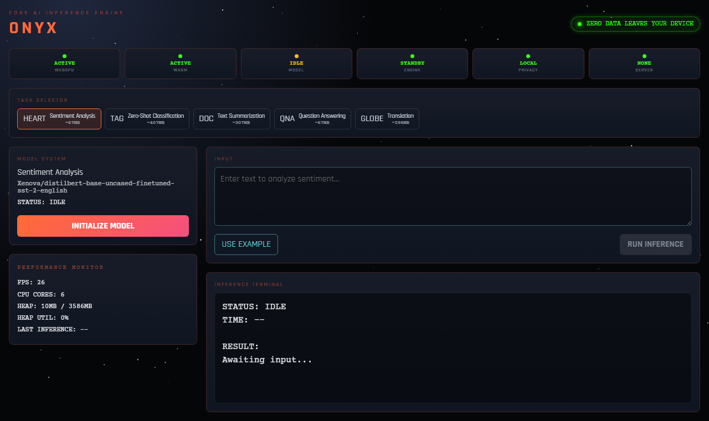
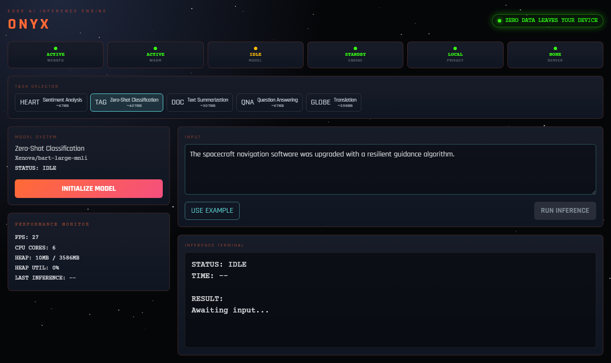
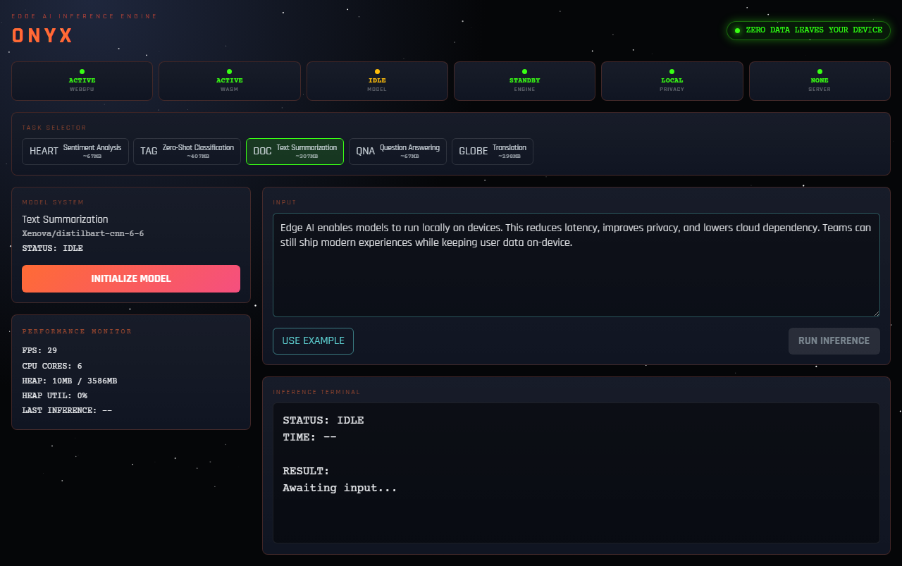
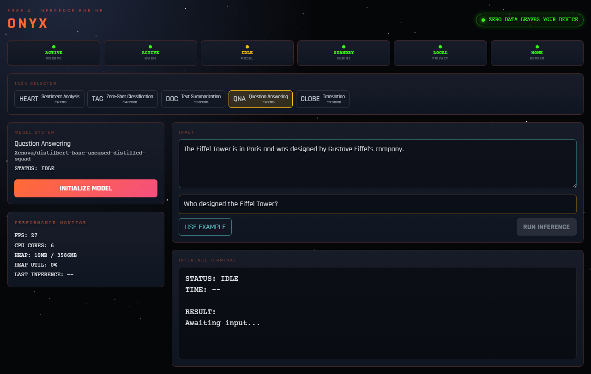
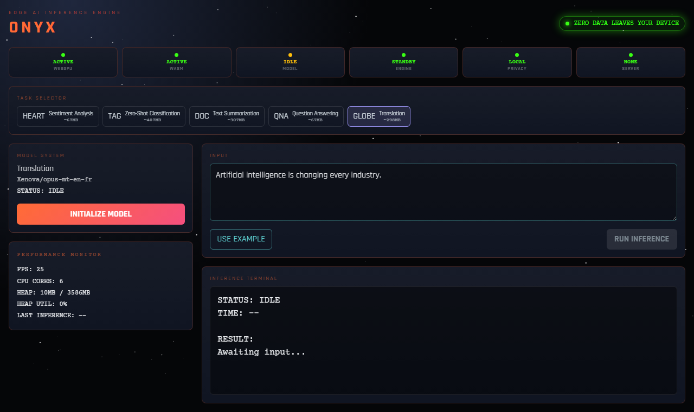

<div align="center">

# ONYX

### Production-Grade Edge AI Inference Platform

[](https://react.dev/)
[](https://vitejs.dev/)
[](https://github.com/xenova/transformers.js)
[](https://web.dev/progressive-web-apps/)
[](https://github.com/crastatelvin/ONYX/actions)

<br/>

> **ONYX** delivers high-performance, browser-native AI inference with a mission-control UX.
> It is fully client-side: no backend dependency, no API keys, and no user data egress.

<br/>


</div>

---

## Table of Contents

- [Overview](#overview)
- [Application Preview](#application-preview)
- [Features](#features)
- [Architecture](#architecture)
- [Tech Stack](#tech-stack)
- [Project Structure](#project-structure)
- [Installation](#installation)
- [Usage](#usage)
- [Deployment](#deployment)
- [Performance and Security Notes](#performance-and-security-notes)
- [Design Decisions](#design-decisions)
- [License](#license)

---

## Overview

ONYX is designed as a product-quality reference for private, low-latency edge AI experiences in the browser.
It executes `@xenova/transformers` pipelines inside a dedicated Web Worker to preserve UI responsiveness while running non-trivial model workloads.

Core capabilities:

- Task-driven local inference with real-time model load status
- Privacy-preserving execution path with zero server calls
- Operational visibility (runtime status, FPS, memory, CPU cores)
- Installable PWA behavior with offline-friendly shell/runtime caching
- Simple static deployment path (GitHub Pages, Vercel)

---

## Application Preview

Screenshots below are generated from the current ONYX build and stored under `artifacts/screenshots`.

<div align="center">

### 1) Dashboard Overview


<br/>

### 2) Zero-Shot Classification


<br/>

### 3) Summarization Input Ready


<br/>

### 4) Question Answering Ready


<br/>

### 5) Translation Model Loading


</div>

---

## Features

| Feature | Description |
|---|---|
| Browser-native inference | All model execution happens on the client device |
| Worker-isolated runtime | Inference pipeline runs off the main thread |
| Multi-task model operations | Sentiment, zero-shot classification, summarization, Q&A, translation |
| Mission-control UX system | Aerospace visual language with terminal-centered results |
| Runtime observability | FPS, memory, CPU cores, model/engine state indicators |
| PWA readiness | Installable app shell with service worker caching |
| Production deployment flow | CI-driven GitHub Pages deployment + Vercel support |

---

## Architecture

```text
┌──────────────────────────────────────────────────────────────┐
│                     Browser (Client Only)                    │
│                                                              │
│  React + Vite UI                                             │
│     ├─ MissionControl dashboard                              │
│     ├─ Task selector + model loader + terminal               │
│     └─ Performance monitoring + privacy/status badges        │
│                                                              │
│  Web Worker (inference.worker.js)                            │
│     └─ @xenova/transformers pipeline execution               │
│                                                              │
│  Browser Storage                                             │
│     └─ model/cache reuse + service worker caches             │
│                                                              │
│          NO SERVER | NO API KEY | NO DATA EGRESS             │
└──────────────────────────────────────────────────────────────┘
```

---

## Tech Stack

| Layer | Technology |
|---|---|
| Application | React 18, Vite 5 |
| Inference runtime | `@xenova/transformers` |
| UI animation | Framer Motion |
| Execution isolation | ES module Web Worker |
| Offline/installability | `manifest.webmanifest`, service worker |
| Delivery | GitHub Actions + GitHub Pages, Vercel |

---

## Project Structure

```text
ONYX/
├── frontend/
│   ├── public/
│   │   ├── manifest.webmanifest
│   │   ├── sw.js
│   │   ├── icon.svg
│   │   └── icon-maskable.svg
│   ├── scripts/
│   │   └── capture-screenshots.mjs
│   ├── src/
│   │   ├── components/
│   │   ├── hooks/
│   │   ├── styles/
│   │   ├── utils/
│   │   ├── workers/
│   │   ├── App.jsx
│   │   └── main.jsx
│   ├── index.html
│   ├── package.json
│   ├── vite.config.js
│   └── vercel.json
├── artifacts/
│   └── screenshots/
├── .github/workflows/deploy-pages.yml
├── DECISIONS.md
├── LICENSE
└── README.md
```

---

## Installation

```bash
git clone https://github.com/crastatelvin/ONYX.git
cd ONYX/frontend
npm install
npm run dev
```

Local endpoint: `http://localhost:5173/`

---

## Usage

1. Select an AI task from the task panel.
2. Click `INITIALIZE MODEL` (first run downloads and caches model artifacts).
3. Provide input text (and question input for Q&A mode).
4. Execute with `RUN INFERENCE`.
5. Review output in the terminal panel and runtime telemetry surfaces.

---

## Deployment

### GitHub Pages

- Workflow definition: `.github/workflows/deploy-pages.yml`
- Trigger condition: push to `main`
- Live site: `https://crastatelvin.github.io/ONYX/`

### Vercel

```bash
cd frontend
vercel --prod
```

`frontend/vercel.json` includes SPA rewrite and required COEP/COOP headers.

---

## Performance and Security Notes

- Inference path is fully local and backend-free by design.
- Initial run fetches model assets from Hugging Face CDN; subsequent runs benefit from cache reuse.
- Service worker provides resilient app shell/runtime behavior for repeat sessions.
- Dependency posture is hardened (`npm audit --omit=dev` clean at current baseline).

---

## Design Decisions

See [`DECISIONS.md`](./DECISIONS.md) for architectural rationale, trade-offs, and implementation choices.

---

## License

This project uses the license in [`LICENSE`](./LICENSE).  
                Built by Telvin Crasta.
